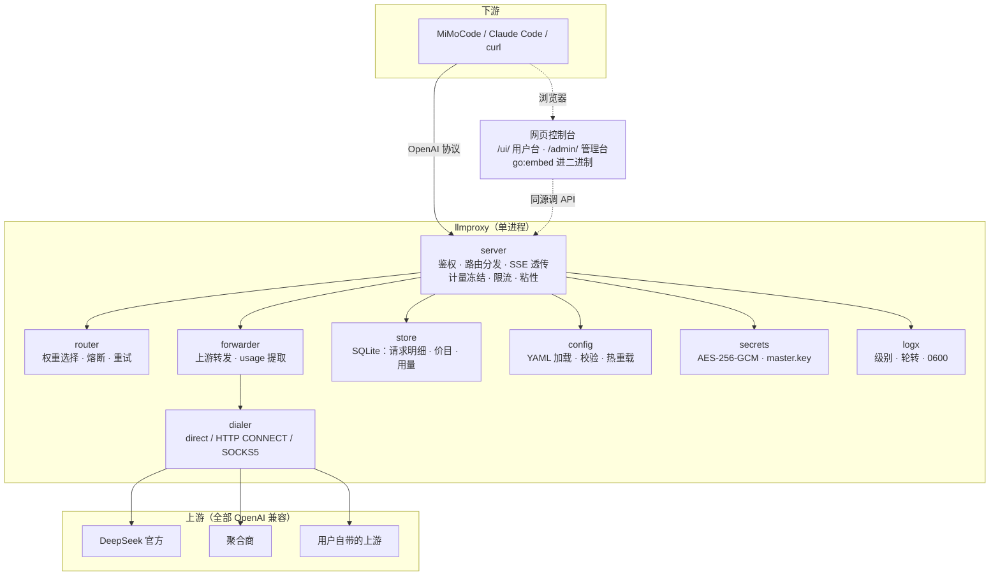
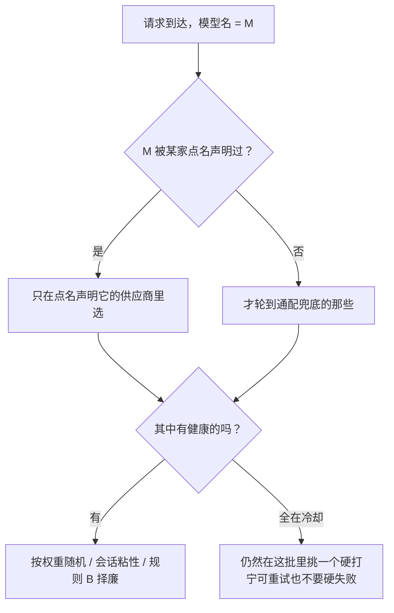

# llmproxy

**一个静态二进制文件，就是全部。**

自用的 LLM 转发网关：下游说 OpenAI 协议，上游也全是 OpenAI 兼容端点，中间这层负责
**选路、容错、计量、多用户**。没有 Docker，没有 Python 运行时，没有数据库服务，
没有需要 `npm install` 的控制台 —— 一个 11 MB 的可执行文件，配置是一份 YAML，
账本是一个 SQLite 文件。

```
13,782 行 Go 生产代码  ·  11,542 行测试代码  ·  292 个测试  ·  2 个直接依赖
darwin / linux × amd64 / arm64  ·  CGO_ENABLED=0  ·  压缩包 4.9 MB
```

> 这份文档讲**它是什么、为什么这么设计、以及哪些地方它故意不做**。
> 操作细节（完整配置项、每个 HTTP 接口、CLI 全部子命令）在 [README.md](../README.md)，
> 计价模型的设计推导在 [pricing-design.md](./pricing-design.md)。

---

## 目录

- [为什么又造一个](#为什么又造一个)
- [与同类项目的取舍](#与同类项目的取舍)
- [30 秒上手](#30-秒上手)
- [架构](#架构)
- [核心能力](#核心能力)
  - [一、路由：模型名是三层，不是一层](#一路由模型名是三层不是一层)
  - [二、可用性：熔断要能看见流中途的失败](#二可用性熔断要能看见流中途的失败)
  - [三、计量：钱在请求发生的那一刻就定死](#三计量钱在请求发生的那一刻就定死)
  - [四、多用户：两种模式，两条铁律](#四多用户两种模式两条铁律)
  - [五、安全：14 条约定，以及 2 条已知例外](#五安全14-条约定以及-2-条已知例外)
  - [六、运维：改完就生效，不用重启](#六运维改完就生效不用重启)
- [实测数据](#实测数据)
- [工程质量](#工程质量)
- [一次真实审阅的记录](#一次真实审阅的记录)
- [明确的边界：不做什么](#明确的边界不做什么)
- [部署](#部署)
- [常见问题](#常见问题)

---

## 为什么又造一个

因为「自己机上跑一个 LLM 网关」这件事，现有方案都偏重。

真实的处境是这样的：你有几家上游（官方 DeepSeek、某个聚合商、也许还有公司内部的
转发服务），手上几个工具（MiMoCode、Claude Code、自己写的脚本）都要用它们。
你希望：

1. **一个模型名背后能挂多家**，一家挂了自动换另一家；
2. **一段对话别被打散**——上游的前缀缓存按（账号 + 模型）分区，换一家等于从冷缓存
   重来，而命中价与未命中价差着 **50 倍**；
3. **知道钱花在哪**，最好能算清「这一笔当时用的是哪一档价」；
4. 如果要给别人用，**别让别人白用你的密钥**，也别让一个人的抖动连累所有人。

这四件事本身都不难。难的是找到一个**不为此引入一整套运行时**的实现。

LiteLLM 能做，代价是一个 Python 服务和它的依赖树；one-api 那一类能做，代价是一个
带注册、充值、面板的多租户系统。而你只是想在机器上跑一个东西，它别出错、别占地方、
出问题能看懂日志。

llmproxy 就是这个取舍的产物：**功能收窄到「OpenAI 兼容 → OpenAI 兼容」这一条路，
把省下来的复杂度全部投到路由、计量与故障归因的正确性上。**

---

## 与同类项目的取舍

不是谁更好，是解决的问题不同。这里只说 llmproxy 选了什么、放弃了什么。

| | **llmproxy** | LiteLLM 类 | one-api 类面板 |
|---|---|---|---|
| 形态 | 单个静态二进制，11 MB | Python 服务 / Docker 镜像 | Go 服务 + Web 面板 + DB |
| 运行时依赖 | **2 个 Go 模块**，无 cgo | Python 及其依赖树 | 通常需外部 MySQL/Redis |
| 上游协议 | **只支持 OpenAI 兼容** | 100+ 提供商原生适配 | 多渠道多协议 |
| 面向 | 运营者自己 + 少数已知用户 | 团队 / 企业 | 公开多租户运营 |
| 用户注册、充值、支付 | **没有，刻意不做** | 有（企业版） | 有，是核心 |
| 计价模型 | 两层价目 + **按请求冻结** + 整点生效 + 带历史 | 按模型单价实时计算 | 按额度/倍数扣费 |
| 会话粘性（保前缀缓存） | **有，三维键 + 规则 B 择廉** | 无对应概念 | 无对应概念 |
| 部署 | 拷一个文件 | 起一个容器 | 起服务 + 建库 + 配面板 |

**放弃的东西要说清楚**：

- **不支持非 OpenAI 协议的上游。** 没有 Anthropic 原生、没有 Bedrock、没有 Vertex。
  要接这些就在前面再套一层转换，或者用别的工具。这条限制换来了转发路径的极简 ——
  整个 `relay` 只需要处理 JSON 与 SSE 两种形状。
- **不是多租户运营系统。** 没有注册页、没有充值、没有发票、没有套餐。用户是运营者
  用 CLI 或管理接口建的，数量级是「几个人」，不是「几万人」。
- **金额是计量，不是清算。** 它算得清每一笔该收多少，但不做预付款、不做扣款、
  不做对账。想拿它当计费系统收钱，缺的东西很多，而且是故意缺的。

**换来的东西**：

- 部署就是 `scp` 一个文件。Alpine 精简容器里跑得动（纯 Go SQLite，不需要 cgo，
  也不需要 glibc）。
- 出问题只需要看一个日志文件和一个 SQLite 文件，不需要理解一个框架。
- 全部逻辑在一个进程里，没有服务间调用、没有消息队列、没有缓存一致性问题。

---

## 30 秒上手

```bash
# 1. 拿一个二进制（或自己编：go build -o llmproxy ./cmd/llmproxy）
tar -xzf llmproxy-v1.9.6-dev-linux-amd64.tar.gz && cd llmproxy-v1.9.6-dev-linux-amd64

# 2. 初始化运行时目录（默认 ~/.config/llmproxy/）
./llmproxy init

# 3. 编辑配置：填 api_keys 与 providers
$EDITOR ~/.config/llmproxy/config.yaml

# 4. 前台启动
./llmproxy start
```

最小可用配置：

```yaml
server:
  host: 127.0.0.1          # 默认只听本机；改成非回环必须先配 api_keys，否则拒绝启动
  port: 8787
  api_keys:
    - sk-local-change-me

providers:
  - name: deepseek
    enabled: true
    base_url: https://api.deepseek.com/v1
    api_key: ${DEEPSEEK_API_KEY}     # 支持 ${ENV} / ${ENV:-default}
    weight: 3
    models: ["*"]                    # "*" = 任意模型名直通
```

然后客户端把 base URL 指过来就行：

```bash
curl http://127.0.0.1:8787/v1/chat/completions \
  -H "Authorization: Bearer sk-local-change-me" \
  -H "Content-Type: application/json" \
  -d '{"model":"deepseek-chat","messages":[{"role":"user","content":"你好"}]}'
```

想确认它活着、以及现在能用哪些模型，直接打 base URL 就行（`GET /v1` 与 `/v1/models`
返回完全一致，匿名仍然 401）：

```bash
curl http://127.0.0.1:8787/v1 -H "Authorization: Bearer sk-local-change-me"
# {"object":"list","data":[{"id":"deepseek-chat","object":"model","owned_by":"llmproxy"}]}
```

响应头里会告诉你**是哪家上游接走的**、以及粘性决策：

```
X-Llmproxy-Provider: deepseek
X-Llmproxy-Request-Id: cfd1913d91b05c41
X-Llmproxy-Affinity: sticky        # new / cheapest / sticky / drift
```

---

## 架构

一个进程，七个内部包，职责不重叠：



**几个刻意的结构决定：**

- **`internal/` 而非 `pkg/`**：这不是一个库，没有对外 API 承诺，所以不给别人 import 的机会。
- **控制台与网关同源**：网页不额外起服务、不额外开端口。页面要带着 token 调 `/v1/_me*`，
  同源就没有 CORS 问题。静态资源 `go:embed` 进二进制，部署时不用分发文件。
- **界面只是接口的一层皮**：页面上每个动作都走同一套 HTTP 接口，所以你在浏览器里
  看到的能力，和你用 curl 调接口看到的能力完全一致。没有「只有界面能做」的操作。
- **SQLite 单连接**（`SetMaxOpenConns(1)`）：这是**正确性支柱**，不是偷懒。
  详见[实测数据](#实测数据)一节。

---

## 核心能力

### 一、路由：模型名是三层，不是一层

这是整个系统里最容易搞错、也最值得讲清楚的一件事。

客户端发来的 `model` 字段，到真正打给上游时，中间可能经过**两次改名**：

```
第 1 层  客户端发来的名字        user_models.model      ← 白名单，必须命中，否则 403
第 2 层  供应商侧的模型名        user_models.upstream   ← 留空 = 与第 1 层同名
第 3 层  真正打出去的上游模型名  供应商 models 映射的值  ← 各供应商可以各不相同
```

为什么要三层？因为**同一个模型在不同供应商那里叫不同名字**。你想让客户端统一发
`deepseek`，但官方那边叫 `deepseek-chat`，某个聚合商那边叫 `gp-5.6-so`。
三层映射让这件事变成配置，而不是让客户端去记每家的名字。

生产上的真实例子：客户端发 `gpt-5-sol` → 供应商侧仍是 `gpt-5-sol` → 聚合商那边
映射成 `gp-5.6-so` → 上游最终回报 `gpt-5.6-sol-2026-07-09`。四层名字，一条链路。

#### 点名声明优先于通配兜底

一家写了 `models: ["*"]` 的供应商等于声明「任何模型名我都接」，所以它也会成为
那些**别人点名声明过**的模型名的候选。如果两者平权、各自按权重随机，同一个模型名
就会时而正常、时而报错。

这是踩过的坑：`deepseek`（直通）与 `neolink`（点名 `gpt-5-sol`）权重都是 1，
实测十次里七次把 `gpt-5-sol` 送去了 `deepseek`，而那边只认 `deepseek-flash` /
`deepseek-v4-pro`，于是一半请求 400。

所以选路次序是：



一个推论值得记住：**只要有人点名声明了某个模型名，兜底那家就再也不会拿到它。**
想让某个名字重新回到兜底，就得把点名那条删掉。

#### 会话粘性：把一段对话钉在同一个后端

上游的前缀缓存按（账号 + 模型）分区。一个模型名背后有多家供应商时，权重随机选路
会把一段对话打散到多家 —— 换一家等于从冷缓存重来。

**实测数据**：一路只走 `deepseek-flash` 时命中率 **98.5%**（136 次请求、
5983 万 prompt token）；一旦被摊到多家，单家的复用次数就被摊薄，命中率随之下降。
而 DeepSeek 的缓存命中价只有未命中价的 **1/50**（¥0.04 vs ¥2 每百万 token）——
对 agent 这类「长前缀反复复用」的负载，这一项就是成本的大头。

所以下游在请求头 `x-session-affinity: ses_...` 里带会话 id，网关据此粘住。

**键是三维的：`(用户, 会话, 模型)`。**

模型必须进键 —— 一个会话会调多个模型（MiMoCode 就有 model / small_model /
vision_model），而缓存本来就按模型分区。只按会话记的话，模型之间会互相改写这条记录：
调完 B 再调 A 时，粘性已经指着一家不承接 A 的供应商，于是每次换模型都要漂移一次。
不同用户的同名会话 id 也互不影响。

**粘性是软约束**，两条边界：

- 它只在**最终候选池**里生效 —— 粘性决定的是「这批合法候选里挑哪一家」，
  不能绕过上面那条「点名声明优先于通配兜底」。
- 那家**正在冷却**、或者**流中途失败**时不粘，直接漂移。

第二条尤其要紧：4xx 与流中途失败都**不触发熔断**，如果不主动忘掉粘性，
会话会被钉在一家只会报错的后端上死循环。所以判据不是熔断，而是「这家对这个名字
报错了 / 没跑完」。

观测头 `X-Llmproxy-Affinity` 四个值，排障与上线验证都看这一列：

| 值 | 含义 |
|---|---|
| `sticky` | 按粘性选中，缓存复用 |
| `drift` | 粘性那家不可用，本次漂到别家并更新了粘性 |
| `cheapest` | 新会话，按当前上游价挑了最便宜的（规则 B） |
| `new` | 没有粘性也没有价目可挑，按权重随机 |

条目**刻意不持久化**：重启后粘性全丢，代价只是每个活跃会话迁移一次（一轮冷缓存），
换来的是每次请求都不用落盘。为一个「省一次换家」的优化去写库，不值。

#### 规则 B：新会话按当前价挑最便宜的

粘性只管「已有的会话继续用哪家」。**新起一个会话**时还没有缓存要保，那就该省钱 ——
按**当前上游价**从低到高挑，而不是权重随机。

三条边界都是刻意的：

- **只按有价目的候选比价。** 没录价目的候选不参与（不知道价不等于便宜）；
  全都没价目就退场，行为与没有这个功能时完全一致 —— 所以它在没录价之前是静默的，
  不会悄悄改变选路。
- **币种不符的候选也跳过**，而不是当成 0 价。排序键是 `(in_miss + out)` 的**数值**，
  混币种会比出完全错误的结果：一家报 USD `2.5+10`、另一家报 CNY `2+8`，
  数值上后者胜出，而前者约合 ¥18+¥72 其实更便宜 —— 选错供应商能差 3~7 倍。
  跳过而不是当 0 价，是因为当 0 会让它永远胜出，那比不参与还糟。
- **上游回 402（额度不足）/ 429（被限流）时，一次就给这家压一段短期冷却**
  （5 分钟，比常规熔断长）。攒够失败次数再冷却太慢，规则 B 会一遍遍把请求送到
  已经没额度的家。

**规则 A 压过规则 B**：会话一旦粘住，就不为省价而迁移 —— 缓存省下的输入价
（命中与未命中差 50 倍）远大于供应商之间的价差。

---

### 二、可用性：熔断要能看见流中途的失败

#### 重试与熔断

```
请求 → 按权重选中供应商 A
        ↓ 失败（网络错误 / 401 / 403 / 404 / 408 / 429 / 5xx）
      排除 A，再按权重选供应商 B
        ↓ 失败
      ……直到 retry 次数用尽 → 返回最后一次错误
```

- **400 / 422 等「请求本身有问题」的状态码不重试**，直接返回给客户端。
  换一家也还是 400，重试只是白花钱。
- 同一供应商连续失败达到 `failure_threshold` 后，`cooldown_seconds` 内不再被选中；
  冷却结束自动恢复。
- 若所有候选都在冷却中，**仍会按权重选一个硬打** —— 宁可重试也不要硬失败。
- **熔断按 `(用户, 上游)` 分桶。** 一个用户把自己的上游打成 429，只影响他自己，
  不再连累其他人。单用户时代的「一家抖动、全体失败」在用户自带上游后不再存在。
- 运行期状态持久化在 SQLite 里，**重启后熔断计数不会归零**，而且按作用域正确归位。

#### 超时：非流式看总时长，流式看有没有动静

同一个 `timeout` 落到两种请求上是两回事，所以拆成两个：

| 请求类型 | 管什么 | 配置 |
|---|---|---|
| 非流式 | 整条请求-响应的**总时长** | `request_timeout_ms` 与供应商 `timeout_ms` 取较小值 |
| 流式 (SSE) | **连续多久没收到字节** | `stream_idle_timeout_ms`（默认 2 分钟，显式 `0` = 关闭） |

为什么流式不能用总时限：一次长回答正常就要跑几分钟，按总时限掐会把好端端的流切断；
而「上游卡住不动」又该早点失败，不该耗满总时限。改成空闲判据之后两种情况都对 ——
每个 chunk（以及响应头到达）都会重置计时，所以「慢但活着」不会被误杀，
「一动不动」会在空闲上限处断开。

代价是流式**不设总时限**了：一个一直慢速吐字节的上游理论上可以挂很久，
由客户端断开兜底。这是明确接受的取舍。

#### 故障归因：四种结局要分得清

LLM 转发最难的不是转发，是**出了事能说清是谁的问题**。日志里一句
`context canceled` 可能意味着三件完全不同的事，所以归因被拆成四类：

| `error_type` | 含义 | 记供应商失败? | 粘性 |
|---|---|---|---|
| `upstream_idle` | 上游连续 N 秒没吐字节，看门狗掐的 | **是** | 漂移 |
| `upstream_body` | 非流式响应读失败 / 超过 32 MB 上限 | **是** | 漂移 |
| `client_gone` | 客户端在响应结束前自己断开 | **否** | 漂移 |
| `relay_error` | 归因不明（MultiWriter 把读写两边的错误合成了一个） | **否** | 漂移 |

后两条的「否」是重点：**客户端断开不是供应商的错**。

这一条是生产上实测出来的。曾经 `RoundTrip` 报 `context canceled` 时一律算供应商失败，
于是一次 curl 超时断开会让日志里出现：

```
[WARN] 供应商 neolink-chengguang 请求失败: context canceled
[WARN] 供应商 deepseek 请求失败: context canceled
[WARN] 请求失败 status=502 type=upstream_unavailable msg=所有上游供应商均不可用
```

而 `deepseek` **压根没被调用过** —— 因为 ctx 已经取消，重试时 `RoundTrip` 根本不发
网络请求就立刻失败，于是循环把候选池里每一家都赖了一遍。`retry: 2` +
`failure_threshold: 3` 的默认配置下，**一次客户端断开就足以把整个供应商池打进冷却**。

修完之后同一种断开长这样：

```
[INFO] 客户端在上游响应前断开 ip=… model=gpt-5-sol provider=neolink-chengguang
[WARN] 请求失败 status=499 type=client_gone msg=客户端在上游返回前断开
```

只提到一家、不重试、不记失败。`499` 沿用 nginx 对「客户端主动断开」的记法。

**同理，「成功」也不能报得太早。** 曾经 `ReportSuccessFor` 在读到 body 之前就执行，
于是一家「返回 200 响应头、然后卡死不吐字节」的供应商 —— 正是空闲看门狗专门为它
设计的那种故障 —— 会被**永久判为健康**：看门狗掐掉它、库里记成 `upstream_idle`，
router 却毫不知情，而粘性还会把整个会话钉死在它上面。两个自愈机制于是组合成了
一个持久故障放大器。现在熔断与粘性都等 relay 的实际结果再决定。

---

### 三、计量：钱在请求发生的那一刻就定死

这是 llmproxy 里设计密度最高的一块，也是最容易做错的一块。

#### 两层价格，互不干扰

```
cost  = f(供应商, 上游模型, 时段, 请求开始时刻)   ← 我们付给上游的钱
price = f(用户,   下游模型, 时段, 请求开始时刻)   ← 我们向用户收的钱
毛利  = price − cost
```

| 层 | 数据源 | 驱动什么 |
|---|---|---|
| 上游价（cost） | `provider_prices` | 规则 B 的路由择廉、真实成本报表 |
| 分发价（price） | `user_prices` | 向用户计费、配额消耗的金额口径 |

**路由只看上游价，计费只看分发价。** 两层独立维护：你可以给某个用户打折而不影响
选路，也可以换一家更便宜的上游而不改变对用户的报价。

#### 按请求冻结

每条请求落库时，用「该请求**开始时刻**」生效的价目行把金额算好写死：

```
requests 表的计价列
  price_upstream_id     本次用的上游价目行 id（回溯用）
  cost_upstream         冻结的上游成本
  price_downstream_id   本次用的分发价目行 id
  charge                冻结的向用户计费金额
  currency              币种
```

**此后改价不影响历史。** 价目行 id 保留下来，所以哪怕价格改过十次，仍能查出
「这一笔当时用的是哪一档」。

`usage_user_daily` 的金额是 `SUM(冻结值)`，不再实时查价；配额口径读的也是它 ——
账单与配额同源，不会对不上。

#### 整点生效，跨点整单按开始时刻

价目行的 `valid_from` **必须是整点**，接口会拒绝非整点的值而不是静默取整 ——
静默取整会在「我以为立即生效」的场景里造成意外（配 01:30 生效、系统悄悄变 01:00，
账就对不上）。

跨点请求（开始在上一小时、结束在下一小时）**整单按开始时刻的价**：

```
价目表   ├─ 旧价（≤ 01:00）─┤── 新价（≥ 01:00）──┤
请求           [— start 00:55 ————— end 01:35 —]
计价             全程按 00:55 所在小时的旧价
```

最硬的理由是**可实现性**：上游只在响应结束时给一份 `usage` 快照，**没有 token 时间线**。
要把输出 token 按生成时刻切进两个小时，只能按请求时长摊分 —— 那是估计，不是计量。
不做假账。

代价明确接受：23:59 发起、跑 40 分钟的请求，全程按旧价结算。绝大多数请求远短于一小时。

#### 按时间只追加

同一 `(供应商, 模型)` 插入新价时，此前有效的行自动收口成 `[旧.valid_from, 新.valid_from)`。
历史天然保留，随时可回溯：

```
id=1  2026-09-21T16:00Z → 2026-09-24T08:00Z   0.04/2/8     ← 已收口，仍然可查
id=3  2026-09-24T08:00Z → (开放)              0.04/2/8     ← 当前生效
```

折扣不单独建模：改价时插一条新行、`note` 里写明来源即可。折扣来源太杂
（商务谈判、促销、返点、阶梯），模型化只会造出没人用的字段。

#### 峰谷计价

DeepSeek 明码标价「空闲时段是高峰价的一半」，所以单价是「供应商 × 模型 × 时段」的函数。
价目行自带峰谷规则：

```json
{"peak_hours": ["09:00-12:00", "14:00-18:00"], "off_peak_ratio": 0.5, "peak_tz": "+08:00"}
```

**填进去的单价是高峰价**，落在空闲时段时乘 `off_peak_ratio`。这与 DeepSeek 官网的
表述完全对应：「北京时间周一至周五（不含中国法定节假日）9:00-12:00、14:00-18:00
为高峰时段；其余时段，包括周末及中国法定节假日全天均为空闲时段。」

三个字段都可空，为空则**逐字段**沿用全局配置（只填时段、时区仍用全局的，这种混着写
是支持的）。两个细节：

- **`peak_tz` 是固定偏移**（`"+08:00"`）而不是时区名（`"Asia/Shanghai"`）。
  固定偏移不依赖系统 tzdata，而 Alpine/musl 的精简镜像里常常没有 zoneinfo，
  `LoadLocation` 会失败。国内供应商本来就固定 +8、没有夏令时。
- **不识别中国法定节假日**：节假日会按高峰价算，属偏高估（不会低估）。
  要更准就在价目行里直接填均价。

判哪一档用的是**请求开始时刻** —— 与「取哪条价目行」同一个时刻，一个请求一个价，可审计。

#### 缓存三档：命中 / 未命中 / 写入

DeepSeek 的缓存命中价只有未命中价的 **1/50**。不区分的话，agent 这类
「长前缀反复复用」的负载金额能高估一个量级。

网关两种回报形状都认：

- **DeepSeek 风格**：`usage.prompt_cache_hit_tokens` / `prompt_cache_miss_tokens`
  （显式两个数）
- **OpenAI / Azure 风格**：`usage.prompt_tokens_details.cached_tokens`
  （只有命中数，未命中由 `prompt_tokens - cached_tokens` 减出来）—— 不少聚合商是这一种

只认第一种的话，第二类上游的命中会被记成 0：**命中率凭空消失、金额按全未命中高估**。

第三档 `in_write`（写入缓存的输入）单价通常比未命中还贵（Anthropic 系约 1.25×）。
留空时自动回落成 `in_miss` 同价。

**两套都不回报时**，按「输入全部未命中」算 —— 宁可高估，不要漏计。

#### 冻结优先，估算兜底

配额必须一直有效，不能因为「还没给某个模型录价目」就整段失效。所以口径是：
**冻结优先，未冻结的部分按 config.yaml 的 `pricing` 表估算兜底**。

切换期的同一天聚合行可能一半冻结一半没冻结，这时按**成功请求数**把估算部分摊出来。
分母用成功数而不是总请求数是有讲究的：失败请求永远不会被冻结，却照样给 `requests` +1，
用它当分母会按失败率线性多收 —— 10% 失败率就多收 10%。

纯成本的报表（`llmproxy stats`）则严格分段：`FROZEN` 列告诉你哪些请求的成本是冻结的，
与 `REQ` 相减就是还没冻结的估算段，**两段别混着看**。

#### 历史不回填

切换前的请求行没有冻结金额，报表里标成「估算段」。**回填等于用当前价伪造历史**，
违背「记录历史计价」的初衷。

这条在生产上验证过：录入价目之后，`neolink/gpt-5-sol` 那行是
`req=12 ok=9 frozen_charges=1` —— 只有价目生效后的那 1 条被冻结，之前 8 条成功的
保持未冻结。

---

### 四、多用户：两种模式，两条铁律

默认它就是「你自己机上的转发网关」：用 `server.api_keys` 里的静态 key 访问，
请求走 `providers` 里的全局上游。**多用户模式**是叠加在这之上的第二种用法。

| | **byo**（自带上游） | **consumption**（消费系统上游） |
|---|---|---|
| 上游是谁的 | 用户自己的 `base_url` + `api_key` | 运营者的 `providers` |
| 账单归谁 | 用户与供应商直接结算 | 网关主人 |
| 网关做什么 | 鉴权、转发、记账留痕 | 上述 + 模型白名单 + 配额 + 限流 |
| 密钥怎么存 | AES-256-GCM 加密落库 | 不涉及 |
| 占不占配额 | **不占**（网关没掏钱） | 占 |

用户不写在 YAML 里，而是存在 SQLite 里（用 `llmproxy user` 管理），因为要保存
加密后的上游密钥。

#### 两条要么想清楚、要么别动的规则

**1. 用户配了自己的上游，就只用他自己的。**

哪怕他配的上游全部不可用，也**不会**悄悄回退到全局 `providers` —— 那等于网关替他付费。
这种情况明确返回 502，并在错误信息里说明原因。只有「一个上游都没配」的用户才落到
全局兜底。

早先版本会静默回退，那等于让用户白嫖网关主人的上游密钥。现在要用系统上游就走
`consumption` 模式（有计量、有配额），报错信息里也会这么提示。

**2. 熔断按 `(用户, 上游)` 分桶。**

一个用户把自己的上游打成 429，只影响他自己，不会再连累其他人。

#### 模型范围默认继承系统池

用户没配自己的映射时，能用的就是他所在系统池声明的全部模型 —— 所以新建一个消费用户，
管理员只要建号 + 设配额，**不必逐用户配模型**，用户开箱可用。

只有需要「给他收窄」或「给他换个名字」时，才给他一份自己的列表。

> ⚠️ 这里有个语义变更值得注意：`user_models` 为空**从「一个模型都不能用」变成了
> 「继承系统池的全部」**。护栏也随之转移 —— 想限制用户用哪些模型，最直接的做法是
> **系统池不暴露那个模型**，再加上配额兜底。权限写在你看得见的一份 config.yaml 里，
> 而不是散在 N 个用户的映射表里。

#### 配额是软限制

判定发生在请求之前，并发请求最多可能超出「同时在飞」的那几条；跨过上限的那一条会放行，
之后的才拒。**要精确到分就不是估算，那是支付系统的活。**

内存计数在进程重启后从库里重建，口径与账单同源（都走冻结优先 + 估算兜底）。
装载时的 DB 读在**锁外**做 —— 否则持锁抢唯一那条 SQLite 连接期间，所有用户的
限流与配额判断全堵在后面，跨月瞬间就是一次集体停顿。

#### 网页控制台：两个入口，互不感知

| 入口 | 给谁 | 用什么登录 | 能做什么 |
|---|---|---|---|
| `/ui/` | 普通用户 | 用户 token | 管自己的上游、看可用模型与用量、发一条请求试链路 |
| `/admin/` | 网关主人 | `server.admin_token` | 编辑系统上游、管用户与配额、配模型范围与价目 |

刻意**不做「同一个页面按 token 猜身份」**：那会让人分不清该拿哪个凭证，
也把两类权限混在一个入口里。两个界面各自只放行自己的静态文件
（`/ui/` 取不到 `admin.js`，反之亦然），共用 `common.js` 与 `app.css`。

token 只存这个标签页的会话里（`sessionStorage`），关掉标签就失效，
不进 URL、Cookie 或 localStorage；两个界面用**不同的会话键**，同一标签页里互不覆盖。

**用户台配模型不写 JSON**：点一下「从上游同步模型列表」，网关拿这个上游的地址和密钥
去拉一次 `/v1/models`，把模型名列出来给你勾。勾选即加入，想换名字就在「已选」表里改
下游名那一列。上游不提供 `/v1/models` 也不挡路 —— 那就手动添加，探测失败不会动你
已经选好的映射。

**管理台改完就能立刻验**：每家上游旁边有「测试」，按下去真发一条 `max_tokens=8` 的
极小请求，回报哪家上游接的、真正打出去的上游模型名、耗时、以及上游回的那句话。
密钥过期、地址配错、这家整个不可用，当场就能看出来。这套探针有三条约束，
e2e 里有断言钉住：**不写记账、不计入任何用户配额、不影响熔断状态** ——
管理员的探测不该出现在用量报表里，否则对账时会对不上。

---

### 五、安全：14 条约定，以及 2 条已知例外

这些是刻意的设计，不是遗漏。每一条都有对应的测试或 e2e 断言钉住。

| 措施 | 说明 |
|---|---|
| 默认只监听 `127.0.0.1` | 改成非本机回环且未配置 `api_keys` 时**拒绝启动** |
| 下游凭证常数时间比较 | 先 SHA-256 摘要再 `subtle.ConstantTimeCompare`，不通过响应时间泄漏长度 |
| 日志只存凭证哈希前缀 | `SHA-256(key)[:6]`，数据库与日志里都没有明文密钥 |
| 不转发下游 Authorization | 上游收到的永远是**该供应商自己的** `api_key`；`extra_headers` 也不许覆盖 `Authorization` / `Host` |
| 不记录请求/响应正文 | 只落模型名、延迟、token 数、状态码、错误类型（例外见下） |
| 下游 POST 只放行推理端点 | `chat/completions`、`completions`、`embeddings` 三条，其余一律 404 |
| `base_url` 不许带 query / 锚点 | 转发时上游 URL 是 `base_url + 下游路径` 直接拼的，一个 `?` 就能把路径吃进 query，从而绕过上面那条白名单 |
| 用户自配上游做出网校验 | link-local（含云元数据 `169.254.169.254`）与未指定地址**一律拒绝**；回环与私网段由 `server.block_local_upstream` 控制 |
| 配置/数据库/日志/备份文件 0600 | 权限过宽会在启动时警告 |
| 代理完全由配置决定 | 直连时显式 `t.Proxy = nil`，忽略 `HTTP_PROXY`/`HTTPS_PROXY`；服务单元还清空 6 个代理环境变量 |
| 被代理的请求走 CONNECT 隧道 | 代理不允许 CONNECT 时明确报错，而不是静默直连 |
| 用户上游密钥加密落库 | AES-256-GCM，每次新随机 nonce；主密钥是运行时目录下 0600 的 `master.key` |
| 自助接口只认自己的身份 | 身份只从**已验证的 token 摘要**反查，没有任何一处从 body/query/path 取用户名；静态 key 无用户身份，自助接口直接 403 |
| 主密钥不可用则拒绝启动 | 库里已有用户却读不到 `master.key` 时直接不启动，而不是让这些用户莫名其妙全部 401 |
| 控制台写回 config.yaml 拒绝控制字符 | YAML 把 lone CR、U+2028、U+0085 也当换行，一个带 CR 的值能逃出 `providers` 段注入新的顶层段 |

#### POST 路径白名单为什么重要

曾经 POST 侧完全敞开、把下游路径原样拼到上游 `base_url` 后面。于是任何持有效 token
的用户都能让网关带着**运营者的上游密钥**去 POST 上游主机上的任意路径：

```
POST /v1/files                  ← 上传任意文件
POST /v1/fine_tuning/jobs       ← 开微调任务，花的是运营者的钱
POST /v1/assistants
POST /v1/organization/...
```

而且这些调用**完全不进计量** —— 消费模式的模型级访问控制因此形同虚设。
GET 侧本来就写了「避免误暴露」并做了白名单，POST 侧现在补齐。

收录判据是「响应形状与 `chat/completions` 同族、`usage` 能被提取出来」：
放行的端点都能被正常计量；不放行的要么没有 usage、要么形状不同
（如 OpenAI 的 `/v1/responses` 用 `output` 而不是 `choices`），转发了就是白送。

编码走私也一并堵住了：白名单比的是 `r.URL.Path`（**已解码**），拼接上游 URL 时用的
也是它 —— 两边同源，所以 `%2F` / `%3F` 无法在「检查」与「拼接」之间制造差异。

#### 出网校验的两档界线

网关会拿用户提供的 `base_url` 发请求、并把上游响应体逐字节回传，所以一个用户可控的
`base_url` 等于「以网关的网络位置读内网」的能力。界线是刻意画的：

- **一律拒绝**（没有开关）：link-local（`169.254.0.0/16`、`fe80::/10`，云元数据服务
  就在这里）与未指定地址（`0.0.0.0` / `::`）。这些永远不是合法的 LLM 上游。
- **`block_local_upstream: true` 时再拒绝**：回环与私网段（RFC1918 / ULA）。
  默认不拒，因为「上游就是本机或同网段的一台推理服务器」（ollama、vLLM、
  公司内部网关）是完全正当的用法。把网关暴露到局域网、且用户不完全可信时再打开。

`config.yaml` 里的系统池是运营者自己手写的，**始终不受此限制**。

生产实测四档全部生效，且两档错误信息不同：

```
http://127.0.0.1:11434/v1                 → 400  已开启 server.block_local_upstream
http://10.0.0.5:9200/v1                   → 400  已开启 server.block_local_upstream
http://192.168.1.1/v1                     → 400  已开启 server.block_local_upstream
http://169.254.169.254/latest/meta-data/  → 400  link-local（含云元数据）
```

#### 前端零 XSS 的做法

`ui/` 全量搜不到一处 `innerHTML` / `outerHTML` / `insertAdjacentHTML` / `eval` /
`document.cookie` / `localStorage`。所有渲染走一个 `h(tag, props, ...kids)` 辅助函数：
文本走 `textContent`，属性走 `setAttribute`，事件走 `addEventListener`。

错误信息挂在 `title` 属性上是 `cell.title = data.error` —— **DOM 属性赋值，
不是 HTML 字符串拼接**，不构成属性注入。静态资源响应带
`Cache-Control: no-store`、`X-Content-Type-Options: nosniff`、`Referrer-Policy: no-referrer`
与 CSP（`script-src 'self'`、`frame-ancestors 'none'`、`base-uri 'none'`、`form-action 'none'`）。

没有任何 `Access-Control-Allow-*` 头，token 在 `sessionStorage` 里 —— 跨站页面既读不到
token，也没法发出预检通过的带 `Authorization` 的请求。

#### 已知例外（两条，都是刻意的）

**1. 上游错误响应体会被留下来，但只给运营者看。**

上游返回可重试的错误状态码时，响应体前 300 字节会写进日志、并存进
`provider_stats.last_error`。排障要用它 —— 不知道上游为什么 4xx 就没法查。
这与「不记录请求/响应正文」是冲突的，所以把**下发面**收窄了：
`GET /v1/_providers` 只对静态 api_key（`llmproxy providers` 用的那个）与 BYO 用户开放，
**消费模式用户一律 403** —— 他们没有自己的上游，调这个接口只会看到系统池的
`base_url`、内联代理 URL（常带 `user:pass`）与系统供应商的错误正文，
而用户台压根不调它。

**2. 出网校验挡不住 DNS rebinding。**

主机名是在**校验时**解析的，校验通过后域名被改指到 `169.254.169.254`，拨号时就会打过去。
要彻底堵住得在 `net.Dialer.Control` 里对**解析后的 IP** 再判一次。当前挡住的是
「直接写 IP」和「解析结果就是内网」这两种绝大多数情况。

---

### 六、运维：改完就生效，不用重启

#### 配置热加载

三条通道，殊途同归：

- **2 秒轮询**：按文件 mtime 判断，变了才解析；解析后与当前配置逐字段比较，
  真的变了才触发重载回调。
- **`llmproxy reload`**：发 SIGHUP。
- **CLI 写操作后主动通知**：`llmproxy user add` 之类的命令改完库会立刻推一把运行中的
  服务，不等那 2 秒 —— 否则窗口期内的请求会吃 401，看起来像「用户根本没建成」。

**校验失败时保留旧配置继续服务**，不会因为一次手滑把网关搞挂。

热加载走的是**严格**模式，与编辑器校验不同：比如「启用的供应商用了 `${ENV}` 但环境
变量没设」这种配置，编辑器会放行（那是推荐写法），但热加载会失败、改动不生效 ——
这种情况接口会明确回一个 `strict_ok: false` 与警告，界面会红字显示。

**「能写进文件」≠「服务会加载它」**，这个区别是刻意保留的。

#### 在控制台里改生产配置文件，安全吗

这块功能会动你服务器上的生产配置，所以四条底线都做了，也都有测试钉住：

| 底线 | 做法 |
|---|---|
| **只动 providers 段** | 按解析后的 AST 定位（不是文本搜索），只替换该段正文；段外的配置项、注释、空行、缩进风格逐字节不变（e2e 里比对段前/段后的 sha256） |
| **密钥不会被清空** | 界面拿到的一律是空串（只给 `has_key` 与脱敏提示），**留空 = 沿用原值**。而且原值从**文件原文**取 —— 从加载后的配置取会把 `${ENV}` 展开成明文，等于把密钥写进文件 |
| **校验不过不落盘** | 先写临时文件、用配置加载器校验、通过才原子改名覆盖；失败时原文件一字不动 |
| **随时能回退** | 每次保存前备份成 `config.yaml.bak-<时间戳>`，只保留最近 5 份，权限同样 0600 |

YAML 标量的引号与转义**一律交给 `yaml.v3`**，不手写规则。手写那版只看 `\n`，
漏掉了 lone CR、U+2028、U+0085 —— 而 YAML 把这三个都当换行，于是一个带 CR 的
供应商名能逃出 `providers` 段、在 config.yaml 里注入一个全新的顶层段
（有过可落盘的 PoC：注入一个 `pricing` 段把所有单价变成 0，配额于是永不触发）。

含控制字符的值**直接拒绝**而不是想办法渲染，两个理由：多行块标量塞进「一个字段一行」
的渲染里缩进会对不上；而更根本的是，供应商名 / base_url / api_key 里出现换行
本身就一定是错误输入（多半是从表格软件或 Windows 环境粘来的）。旧实现会把裸换行
放进双引号标量里 —— 而 YAML 双引号标量的裸换行是「折叠」语义，于是 api_key 被
静默改成 `sk-line1 line2`：校验通过、落盘成功、界面毫无提示，之后那家供应商
每个请求都 401。**响亮地拒绝远好于静默改坏。**

代价说清楚：`providers` 段**内部**的注释会被重渲染掉（保留一行段首说明）。
段外的注释不受影响。所以写回前一律先备份。

#### 作为系统服务

```bash
./llmproxy init
./llmproxy service install
```

- **macOS**：写入 `~/Library/LaunchAgents/com.llmproxy.service.plist`
- **Linux (systemd)**：写入 `/etc/systemd/system/llmproxy.service`
- **Alpine / OpenRC**：手写一个 `/etc/init.d/llmproxy`（见[部署](#部署)）

服务模板会显式清空 `HTTP_PROXY`/`HTTPS_PROXY` 等环境变量，确保出口完全由配置文件决定。

#### CLI 一览

```
llmproxy init | start | stop | restart | status | reload
llmproxy providers           各供应商配置与运行期状态（含熔断）
llmproxy stats [-days N]     消耗统计（含 FROZEN 列区分冻结段/估算段）
llmproxy logs [-n N] [-f]    查看 / 跟踪日志
llmproxy test [-model M] [-stream]
llmproxy user add|list|show|rm|enable|disable|token
llmproxy user mode|quota|limits|models|add-model|rm-model
llmproxy user add-provider|rm-provider|providers|usage
llmproxy admin token|rotate  管理凭证的取值与轮换（写回 config.yaml）
llmproxy config get|set      读写常用标量配置（备份 → 校验 → 原子改名）
llmproxy price list|set      价目录入与历史回溯（整点生效、只追加）
llmproxy service install|uninstall
llmproxy version
```

`status` 不只报版本与健康：还有**本月用量与配额余量**、**价目覆盖**（哪些模型还没录价）、
**各供应商的熔断状态**。`admin` / `config` / `price` 三组把「改配置不必打开含密钥的
`config.yaml`」和「录价不必手写 curl」收成一条命令，写回安全链与管理台同一条。

CLI 的写操作会**主动通知**运行中的服务重载，所以立刻就能用。发信号前会先确认
健康端点真的在应答 —— PID 文件可能是陈旧的（服务被 SIGKILL 或崩溃时不会清它），
而那个 pid 之后可能被系统分配给完全无关的进程，SIGTERM / SIGHUP 的默认动作都是终止。
探不通就不发信号，并提示先 `ps -p <pid> -o args=` 确认它是谁。

---

## 实测数据

### 并发压测

`cmd/llmpbench` 用来回答「这个网关同时能扛多少请求」。默认 `stub` 模式：自己起一个
假上游，再用**独立的运行时目录**拉起一个 llmproxy 实例（独立端口、独立 SQLite），
全程本机、不消耗任何上游额度，也绝不碰正在运行的服务。

```bash
go run ./cmd/llmpbench -concurrency 20,100,300,700,1500 -n 2000      # 吞吐上限
go run ./cmd/llmpbench -stub-delay 1500 -concurrency 500,2000,4000 -n 4000 -cooldown 30
go run ./cmd/llmpbench -stream -stub-delay 1500 -concurrency 500 -n 1000
```

本机实测（M 系列 Mac、本机环回、单实例）：

| 指标 | 数值 |
|---|---|
| 并发承载 | **4000 路稳定零失败，6000 路全通过** |
| 吞吐 | **约 9000 RPS**（300 并发见顶） |
| 上游并发峰值 / 发出并发 | **92%~100%**（说明在真并行转发，没有内部排队） |
| 每路并发内存 | **0.06~0.12 MB** |

跑完还会核对三个数字：**客户端成功数 / 假上游收到数 / 网关数据库落库数**。
三者一致，说明单连接 SQLite 记账路径在并发下没有丢数据。

#### 9000 RPS 这个数是怎么来的

它**不是** CPU、内存或网络的极限，而是那一条 SQLite 连接的串行插入速率 ——
实测 `InsertRequest` 约 109 µs/条，折算 **9144 条/秒**，与压测报的 9000 RPS 吻合到 1%。

记账是同步的（响应之后落库），一条连接，队列论上 M/M/1 在 ρ→1 时延迟发散，
所以 300 并发就见顶了。代码里没有任何入向并发上限，**真正的约束是那条连接**。

而且 9000 是乐观值：压测配置里没有价目行。生产上录了价之后，每请求多 3 次查价
（其中规则 B 那次是全索引扫描），天花板降到约 5000 RPS。

**这个设计要不要改？不要。** `SetMaxOpenConns(1)` 是存储层最重要的正确性支柱 ——
放开它会立刻暴露跨进程事务升级与持锁查库这些目前被串行化掩盖的问题，收益却有限：
SQLite 只允许一个写者，多连接对**写**几乎没有增益。该改的是把热路径上的**读**
挪出那条连接（价目只在整点生效，天然可缓存到下一个整点）。

### 前缀缓存命中率

一路只走 `deepseek-flash` 时：**98.5%**（136 次请求、5983 万 prompt token）。
这是会话粘性存在的理由 —— 命中价是未命中价的 1/50。

### 一个被消掉的 3500 倍性能悬崖

粘性表原本用「一个 map + 每次全表扫找最旧」做淘汰。表满（8192 条）之后，
每次 `Set` 都要扫两遍，全程持全局锁：

| | 旧实现 | 现在（map + `container/list` 真 LRU） |
|---|---|---|
| 表满后单次 `Set` | **423.6 µs** | **357 ns** |
| 64 协程并发 | 4673 ops/s（加并发无效） | — |

触发门槛低到约 **340 个新会话/小时**（0.1 个/秒）。而 `llmpbench` 从不发
`x-session-affinity` 头，所以这条悬崖在压测里**完全看不见** —— 只会觉得
「上游最近有点卡」。

改成真 LRU 的关键洞察是：链表按 `lastUsed` 降序（每次改动 `lastUsed` 都伴随
`MoveToFront`），于是「已过期」必然是**队尾的一段连续前缀** —— 从队尾往前清就等价于
旧实现的全表扫清过期，O(过期条数) 而不是 O(全表)。

---

## 工程质量

```
生产代码   13,782 行 Go
测试代码   11,542 行 Go     ← 比例 0.84 : 1
前端        2,436 行
e2e 脚本      568 行 / 127 项断言
测试函数      292 个
直接依赖      2 个（gopkg.in/yaml.v3、modernc.org/sqlite）
```

### 覆盖率

`internal/` 总体 **77.9%**：

| 包 | 覆盖率 | 说明 |
|---|---|---|
| `logx` | **98.2%** | 日志轮转、0600 权限、级别过滤、Close 后安全 |
| `router` | **93.3%** | 权重分布、熔断与恢复、点名优先、作用域隔离 |
| `store` | 79.4% | 迁移全部有「从真实老 schema 出发 + 验证二次打开幂等」的测试 |
| `server` | 78.3% | 鉴权、映射、重试、SSE、粘性、计价冻结、出网校验 |
| `config` | 72.5% | 解析、校验、热重载、YAML 写回、峰谷、出网 |
| `secrets` | 72.5% | AES-GCM、master.key 生命周期 |
| `dialer` | 69.9% | HTTP CONNECT / SOCKS5 隧道与认证 |

`go test -race` 全绿。

### 端到端验证

`scripts/e2e-multiuser.sh` 起三个假上游（全局兜底 / alice 的 / bob 的）与一个独立
llmproxy 实例，跑 **127 项断言**，覆盖：多用户隔离、byo 不回退全局、熔断分桶、
模型白名单收窄与放开、管理台探针的三条约束（不记账 / 不占配额 / 不影响熔断）、
点名声明优先于通配兜底、价目冻结与峰谷字段、非法输入被拒。

全程本机、不消耗上游额度、不碰正在运行的实例。端口全部动态取，admin token 每次运行
都不同 —— 于是「管理接口 200」本身就证明了回答我们的是本次实例，而不是端口上的残留进程。

### 存储层的并发地基

三件套，缺一不可：

1. **`SetMaxOpenConns(1)`** —— 进程内所有 DB 操作被连接池串行化，
   `SQLITE_BUSY` 在服务进程内部是不可能事件。
2. **聚合全部用原子 UPSERT**（`x = x + excluded.x`）—— 全代码库找不到一处
   「先 SELECT 再 UPDATE」的计数。这是最关键的一条：即使哪天把连接池放开，
   聚合也不会丢更新。
3. **明细 + 两张聚合在同一个事务里** —— 「明细写了、聚合没写」这种半状态
   在结构上不可能出现。

实测 200 协程 × 50 = 10000 条并发写：**零失败，明细与两张聚合表三个数字完全一致**。

连接参数走 DSN 而不是 schema 里的 PRAGMA：`busy_timeout` 与 `synchronous` 是
**每连接**属性，靠一次性 `db.Exec(schema)` 设置只在「池里恰好只有一条永不回收的连接」
时成立；驱动一旦因 I/O 错误重开连接就会静默降级。DSN 里还带 `_txlock=immediate` ——
SQLite 的 `busy_timeout` **不覆盖**「deferred 事务内读锁升级成写锁」，那种冲突会立刻
返回 `SQLITE_BUSY`（刻意的防死锁设计），而价目收口与用户上游 upsert 都是
「先 SELECT 再 UPDATE」。

### 迁移纪律

表重建迁移包在事务里（SQLite 的 DDL 可回滚）；加列迁移幂等（每次先 `hasColumn` 检查）；
四个迁移都有**从真实老 schema 建库、灌数据、再 `Open`** 的测试，并且都显式验证了
二次打开的幂等性。

---

## 一次真实审阅的记录

2026-09 做过一次全面审阅（四路并行：转发链路 / 计费 / 安全 / 存储并发）。
四路共报告 **9 个严重级 + 29 个中等 + 26 个轻微**（另有若干观察项，且跨路有重复计数 ——
比如「非流式响应无上限缓冲」被转发与安全两路各报一次，「计费可被绕过」被转发报为严重、
被计费报为中等）。

**修复情况按层级：**

| 层级 | 报出 | 已修 | 未修 |
|---|---|---|---|
| 严重 | 9 | **8** | 1（见下） |
| 中等 | 29 | **约 20** | 约 7 |
| 轻微 | 26 | **约 8** | 约 18 |

处理原则：**严重级全修**，唯一例外是「管理台 `/test` 回显上游响应体前 300 字节」。
这一项**刻意不修**，理由不是「admin 可信」这种含糊的话，而是修了没有任何收益：

管理侧本来就不做出网校验（`CheckUpstreamEgress` 只在用户侧的
`upsertMyProvider` 与 `discoverUpstreamModels` 两处调用），所以任何持 `admin_token`
的人都可以 `PUT /v1/_admin/config/providers` 把某家系统上游的 `base_url` 设成
`http://169.254.169.254/latest/meta-data/`，再转发一条请求把响应体逐字节读回来 ——
**那已经是一条完整的 SSRF 读通道，而且是设计允许的**（系统池是运营者自己手写的）。
在这个前提下把 `/test` 的 snippet 去掉，攻击面一点没变小，只是让排障变难：
「上游返回 HTTP 404」和「404：这家只认 deepseek-flash / deepseek-v4-pro」
是两个世界。审阅自己也把它标为「中等偏上」，放进严重段只因为它属于 SSRF 这一类。

**真正需要堵的是用户侧**，那已经堵了：见下表 #6。

**中等里凡是影响钱、可用性或安全的都修**；轻微按需。
共改动 19 个生产文件，每一项都配回归测试，关键几条都**临时回退验证过测试确实会失败**。

**未修的中等里，值得知道的几个：**

- `Prune` 会删掉冻结账本 —— 不是 bug，是「请求明细保留天数」与「账本可审计」的
  设计冲突，已写进 [pricing-design.md](./pricing-design.md) 的「实现备注」
- 价目表没有 UNIQUE 约束 —— 但 `_txlock=immediate` 已经关掉了跨进程竞态
  （事务一开始就拿写锁，第二个事务的 `SELECT MAX(valid_from)` 能看到前者的行、
  被「只追加」校验拒掉），所以并列行只能由直接 SQL 插入造成；查价另外加了
  `id DESC` 做确定性 tie-break。为一个 API 已不可达的状态在有真实数据的生产库上
  做迁移，不划算
- 显式传 `valid_to` 会留下永久空洞，且「只追加」规则使其无法回填
- CLI `user show` 的「本月消费」忽略冻结值、用当前单价重算历史，与 API 口径不一致
- 估算兜底路径丢掉 `cache_write_tokens`（`usage_user_daily` 没有这一列）
- `Prune` 是单事务全量 DELETE，期间独占唯一那条连接（20 万行约 467 ms）
- 用户可创建的 provider 数量与 `TransportCache` 都没有上限

下表是**影响最大的 18 项**（不是修复总数）：

| # | 问题 | 后果 |
|---|---|---|
| 1 | `stream_options` 已存在时不注入 `include_usage` | 客户端发一个 JSON 字段就能让整条流式请求**记 0、配额一分不扣**，而上游照样收钱 |
| 2 | `io.MultiWriter(dest, scanner)` 顺序反了 | 客户端在 usage chunk 之前断开就拿到完整答案而记账为 0 |
| 3 | `off_peak_ratio` 缺省时被当成 0 | 价目行只填 `peak_hours` 会让**高峰之外的全部流量成本与计费一起归零**，且完全静默 |
| 4 | 熔断状态恢复接错了 API | 用户级熔断重启即丢，还在库里长出名叫 `"alice/my-up"` 的幽灵行 |
| 5 | 下游 POST 无路径白名单 | 任何持有效 token 的用户能让网关带着运营者的密钥 POST 上游任意路径，且不进计量 |
| 6 | 用户可控 `base_url` 无出网校验 | 与 #5 合起来构成完整 SSRF **读**通道：配 `base_url` 指向内网、POST 任意路径、响应体逐字节回传。另有 `/discover` 可当内网端口扫描 oracle（错误文本回显 net error 与状态码），且完全不受限流约束 |
| 7 | 客户端断开被赖到供应商头上 | **一次断开就足以把整个供应商池打进冷却** |
| 8 | `rowCharge` 摊分分母含失败请求 | 按失败率线性多收（10% 失败率 → 多收 10%），且进程重启会凭空抬高用户当月已用金额 |
| 9 | `in_write` 缺省不回落 | 缓存写入档 token 完全不计费（该档单价通常比未命中还贵） |
| 10 | 流中途失败不进熔断 | 「返回 200 头然后卡死」的供应商永久健康，粘性还会把会话钉死在它上面 |
| 11 | 非流式响应无上限缓冲 | 一个 BYO 用户一次请求就能把网关内存吃光；且中途失败会发出 200 + 截断 body |
| 12 | `retain_days: 0` 与文档相反 | 照文档配「永久保留」的人会在第 90 天丢掉计价冻结账本 |
| 13 | 币种无任何护栏 | 规则 B 可能选出贵 3~7 倍的供应商 |
| 14 | `yamlScalar` 手写转义漏了 lone CR | 带 CR 的供应商名能逃出 `providers` 段注入新的顶层段（有可落盘 PoC） |
| 15 | PRAGMA 不在 DSN + deferred 事务跨进程 BUSY | 连接重建后静默降级；CLI 与服务端并发写随机报 `database is locked` |
| 16 | `DeleteUser` 不级联 | 删用户再建同名会**静默继承前任的模型授权**与熔断计数 |
| 17 | `Stats(since)` 只过滤总计 | `stats --days 1` 打印「总计: 请求 1」，紧接着的按供应商表却是全量历史 |
| 18 | 粘性表满后 O(n²) 淘汰 | 3500 倍性能悬崖，且压测工具不发粘性头，完全看不见 |

（#6 的 DNS rebinding 那一层没有修 —— 主机名是在校验时解析的，要彻底堵住得在
`net.Dialer.Control` 里对解析后的 IP 再判一次。当前挡住的是「直接写 IP」与
「解析结果就是内网」这两种绝大多数情况，已在[已知例外](#已知例外两条都是刻意的)里写明。）

表外还修了若干项：`affinity_ttl_ms` 热重载失效、`serverEqual` 漏比三个字段、
`meterForLocked` 持全局锁读库、并发位释放闭包捕获了用户名而非桶指针、
`readPID` 不校验进程身份、`priced` 字段自相矛盾、`/v1/_providers` 对消费用户过宽。
以及一项**修自己引入的回归**：把 `RetainDays` 改成指针后，`configEqual` 里的
`a.Database != b.Database` 比的是指针身份，导致任何一次配置保存都被判成「变了」
并把上游连接池全部 Reset。

**没修的**都写进了文档而不是藏起来：`pricing-design.md` 的「实现备注」记了 6 处
与设计的刻意偏差（`reasoning_out` 不生效、币种只挡不换、摊分分母的残留不精确、
账本可审计期等于 `retain_days` 等），README 的「已知例外」记了 2 条安全取舍。

**最值得记住的一条教训**来自 #4：正确的函数 `RestoreScoped` 早就写好了、也被单测覆盖了，
但生产代码调的是另一个 `RestoreState`。**单元测试结构上无法发现这类 bug** ——
必须有一个覆盖「落库 → 重启 → 恢复」完整回路的集成测试。

还有一条贯穿性的观察：**所有测试都是单协程、单进程、单连接的**，于是「并发」这个维度上
的一切都靠 `SetMaxOpenConns(1)` 的串行化**掩盖**着，而不是被**验证**着。
而压测工具恰好也不发粘性头、不配价目、不并发跑 CLI —— **压测盲区和单测盲区是同一个**。

修复后 `internal/` 覆盖率从 75.3% 升到 **77.9%**，`logx` 从 0% 到 98.2%（10 个测试），
`limits.go` 从零单元测试到 6 个。

---

## 明确的边界：不做什么

写在这里，免得被误用：

- **不做支付。** 没有预付款、没有余额扣减、没有对账、没有发票。金额是**计量**，
  不是清算。想拿它当计费系统收钱，缺的东西很多，而且是故意缺的。
- **不做多租户运营。** 没有注册页、没有充值、没有套餐、没有用户自助开户。
  用户是运营者建的，数量级是「几个人」。
- **不支持非 OpenAI 协议的上游。** 没有 Anthropic 原生、Bedrock、Vertex。
- **不做汇率换算。** 两张价目表都有 `currency` 列，但聚合、比价、报表都不看它 ——
  所以录价时会**拒绝**与基准币不一致的币种，把「静默算错」换成「响亮报错」。
  真要混币种得先实现换算。
- **不识别中国法定节假日。** 峰谷只认周一~周五，节假日按高峰价算，偏高估（不会低估）。
- **`peak_tz` 只支持固定偏移。** 表达不了 PST/EDT 这类带夏令时的时区。
  固定偏移不依赖系统 tzdata（Alpine/musl 精简镜像里常缺），而国内供应商本来就固定 +8。
- **`reasoning_out` 收下、落库、回显，但计价时不生效。** 我们还没解析上游的
  `reasoning_tokens` —— 拿不到那个数就不该假装算得准，输出一律按 `out` 档计。
- **账本的可审计期 = `database.retain_days`。** `requests` 表正是承载
  `price_upstream_id` / `cost_upstream` / `charge` 的地方，超期会被清理，
  剩下的聚合表只有金额合计、没有价目行 id，无法回溯。要长期对账就把它设成 0（永久）。
- **配额是软限制。** 并发请求最多可能超出「同时在飞」的那几条。
- **流式不设总时限。** 一个一直慢速吐字节的上游理论上可以挂很久，由客户端断开兜底。

---

## 部署

### 直接跑

```bash
./llmproxy init && ./llmproxy start
```

### macOS (launchd) / Linux (systemd)

```bash
./llmproxy service install
```

### Alpine / OpenRC（LXC 容器实战）

`service install` 目前只写 launchd 与 systemd 单元。Alpine 上手写一个
`/etc/init.d/llmproxy`：

```sh
#!/sbin/openrc-run
name="llmproxy"
description="自用 LLM 转发网关（单二进制，无外部依赖）"

command="/opt/llmproxy/llmproxy"
command_args="start"
command_background="yes"
pidfile="/run/llmproxy.pid"
output_log="/opt/llmproxy/llmproxy.out.log"
error_log="/opt/llmproxy/llmproxy.err.log"

# 运行时目录：配置、数据库、日志、主密钥都在这里
export LLMPROXY_HOME="/opt/llmproxy"

depend() {
    need net
    after firewall
}
```

```sh
chmod +x /etc/init.d/llmproxy
rc-update add llmproxy default
rc-service llmproxy start
```

`CGO_ENABLED=0` + 纯 Go SQLite，所以 musl 精简镜像里跑得动，不需要 glibc、
不需要 ca-certificates 之外的任何东西。

### 升级

沿用一个朴素的约定：换二进制之前先把旧的存成 `llmproxy.v<版本>.bak`。

```sh
cp -p /opt/llmproxy/llmproxy /opt/llmproxy/llmproxy.v1.9.5-dev.bak
rc-service llmproxy stop
# 等进程真正退出（优雅关停有排水窗口，别急着 mv）
mv llmproxy.new llmproxy && chmod 755 llmproxy
rc-service llmproxy start
curl -s http://127.0.0.1:8787/healthz     # 看 version 与 uptime_s
```

回滚就是 `cp -p` 回来再 restart。

**升级前确认这一批改动有没有 schema 迁移** —— 没有的话回滚就是纯粹换二进制，
数据库两边都认。

一台真实生产机（Alpine LXC 容器，x86-64）上的记录：连续四次升级
（v1.9.2 → v1.9.6），每次旧进程 0.25 秒内优雅退出、关停时做 WAL checkpoint
（WAL 从 4.1 MB 收到 16 KB）、`/proc/<pid>/exe` 的 sha256 与构建产物逐字节一致、
`err.log` 始终 0 字节。

---

## 常见问题

**Q：为什么不用现成的 LiteLLM？**
A：如果你需要 100+ 提供商的原生适配、或者要一个企业级的多租户面板，用它。
如果你只是想在机器上跑一个东西、把几家 OpenAI 兼容上游聚合起来、并且把钱算清楚，
llmproxy 是一个 11 MB 的文件而不是一个 Python 服务。这个仓库里两个都有
（`litellm-proxy/` 是 Docker 版的 LiteLLM），可以对着看。

**Q：`master.key` 丢了会怎样？**
A：库里已有的用户上游密钥就解不开了，只能让用户重填 —— 这是这套设计唯一的硬代价。
别把它弄丢，也别和数据库放在一起。主密钥不可用而库里已有用户时，服务**拒绝启动**，
而不是让这些用户莫名其妙全部 401。

**Q：金额能精确到分吗？**
A：不能，而且这是刻意的。金额用 `float64`，实测 3000 次累加的相对误差约 1e-15
（¥10,000 的月度配额上绝对误差约 1e-11 元），SQLite 侧与 Go 侧累加结果一致。
配额是**软限制**。要精确到分就不是估算，那是支付系统的活。

**Q：为什么我的 `used_cost` 一直是 0？**
A：三种可能。① 没录 `user_prices` 价目行（`/v1/_me/usage` 的 `priced` 字段会告诉你）；
② 录了但 `valid_from` 还没到（价目只在整点生效）；③ 那些请求发生在录价之前 ——
历史不回填。

**Q：粘性没生效？**
A：按顺序查：① 下游有没有发 `x-session-affinity` 头；② `server.affinity_ttl_ms`
是不是被显式设成了 0；③ 看响应头 `X-Llmproxy-Affinity` —— `new` 说明没粘性也没价目，
`cheapest` 说明走了规则 B，`sticky` 才是粘住了。注意观测头**只在带了会话头时才写**。

**Q：同一个模型名时而正常时而 400？**
A：大概率是「点名声明」与「通配兜底」在打架。只要有人点名声明了某个模型名，
兜底那家就再也不会拿到它。想让某个名字多走几家，就给这几家都写上这条映射。

**Q：怎么知道某家上游为什么在冷却？**
A：`llmproxy providers`（走静态 key）看运行期状态与 `last_error`；
或 `GET /v1/_admin/providers`。消费模式用户拿不到这些 —— 那是刻意的，
详见[已知例外](#已知例外两条都是刻意的)。

**Q：能压多高？**
A：见[实测数据](#实测数据)。短答：4000 路并发零失败，约 9000 RPS，
天花板是那一条 SQLite 连接的插入速率，不是网关的并发数。

---

## 依赖

| 模块 | 用途 |
|---|---|
| `gopkg.in/yaml.v3` | YAML 配置解析与标量编码 |
| `modernc.org/sqlite` | 纯 Go SQLite 驱动（无 cgo，所以能交叉编译四平台） |

网络栈（HTTP 服务、TLS、SOCKS5、CONNECT 隧道）全部基于标准库自己实现，
没有引入 `x/net` 等网络依赖。

Go ≥ 1.22。国内拉模块建议 `export GOPROXY=https://goproxy.cn,direct`。

---

## 相关文档

- [README.md](../README.md) —— 完整配置项、每个 HTTP 接口、CLI 全部子命令、开发指南
- [pricing-design.md](./pricing-design.md) —— 计价与成本模型的设计定稿，
  以及「实现备注」里记录的 6 处与设计的刻意偏差
- [config/config.example.yaml](../config/config.example.yaml) —— 带注释的配置模板
